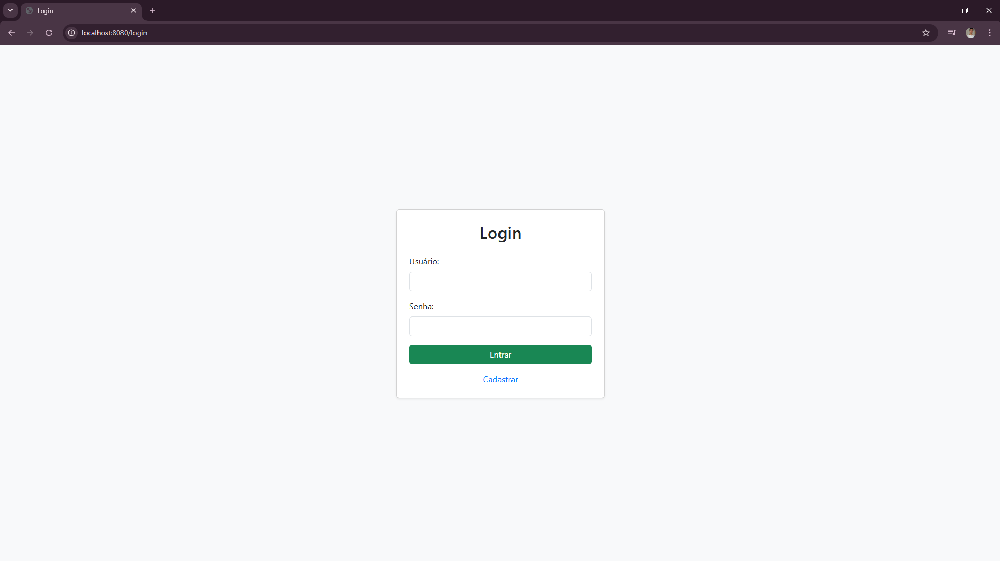
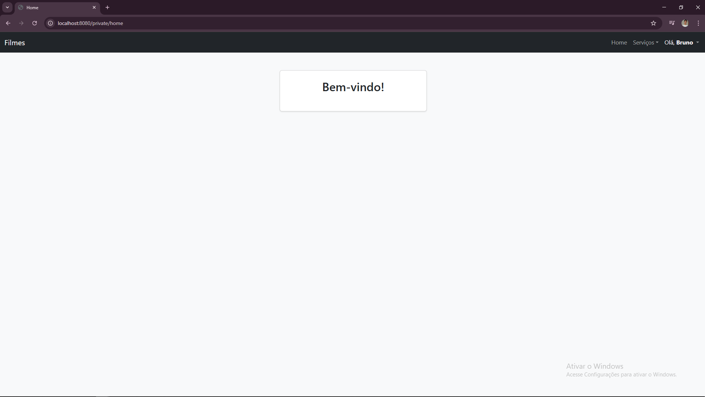
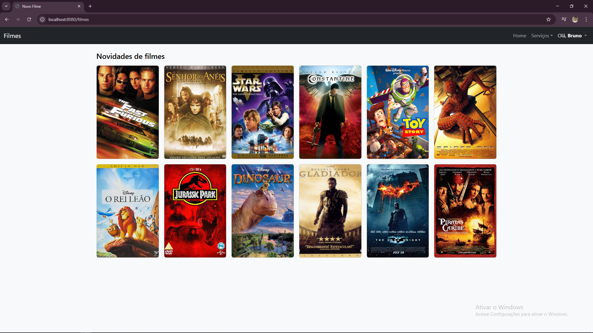
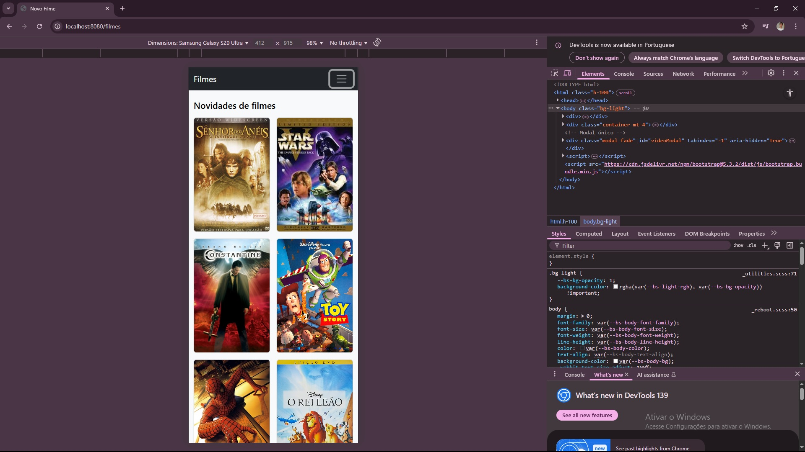

# 🎬 Projeto Spring Boot - Sistema de Login e Gerenciamento de Filmes


Este projeto é um sistema simples de login, cadastro de usuários e gerenciamento de filmes.  
Utiliza **Spring Boot, Spring Security, Thymeleaf e JPA**.  
Implementa autenticação com criptografia de senha e proteção de rotas.

---

## 📌 Funcionalidades

✅ Login seguro com Spring Security  
✅ Interface com Thymeleaf e Bootstrap  
✅ Proteção de rotas para páginas privadas  
✅ Alteração de senha para usuários logados  
✅ Cadastrar, editar, excluir e listar filmes  
✅ Cadastro de usuário com senha criptografada usando BCrypt  
✅ Banco de dados configurado para H2 (padrão) ou PostgreSQL  

---

## 🛠 Tecnologias Utilizadas

- Java 17  
- Spring Boot 3  
- Spring Security  
- Spring Data JPA  
- Thymeleaf  
- Bootstrap 5  
- H2 Database (banco em memória para testes)  
- PostgreSQL (opcional)  

---

## 📂 Estrutura Básica

- **SecurityConfig** → Configuração de segurança e autenticação  
- **AuthController** → Controla login, cadastro e páginas privadas  
- **UsuarioAlteraSenhaController** → Função para alterar senha do usuário  
- **FilmeController** → Cadastro e listagem de filmes  
- **UsuarioRepository / FilmeRepository** → Interfaces de acesso ao banco  
- **Filme / Usuario** → Entidades do sistema  

---

## 📸 Screenshots

### Tela de Login


### Tela Inicial


### Tela de Listagem de Filmes


### Tela de Listagem de Filmes Responsiva


---

## 🚀 Como Executar o Projeto

### 1️⃣ Pré-requisitos
- Java 17 instalado  
- Maven instalado  
- (Opcional) PostgreSQL rodando se quiser usar banco real  

### 2️⃣ Clonar o repositório
```bash
git clone https://github.com/BrunoFelicianoAlves/projeto-springboot-login.git

3️⃣ Rodar o projeto

mvn spring-boot:run

4️⃣ Acessar pelo navegador

http://localhost:8080/login

# No arquivo application.properties, já está configurado:

server.address=0.0.0.0
server.port=8080

# Agora basta descobrir o IP da sua máquina:

Digite no cmd: ipconfig

# Pegue o endereço IPv4 e acesse pelo celular:

http://192.168.x.x:8080/login


👨‍💻 Autor

Bruno Feliciano Alves

LinkedIn | GitHub
